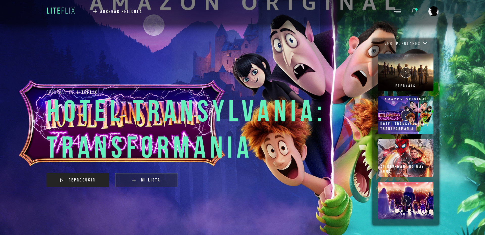
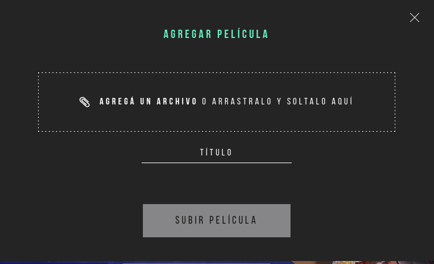
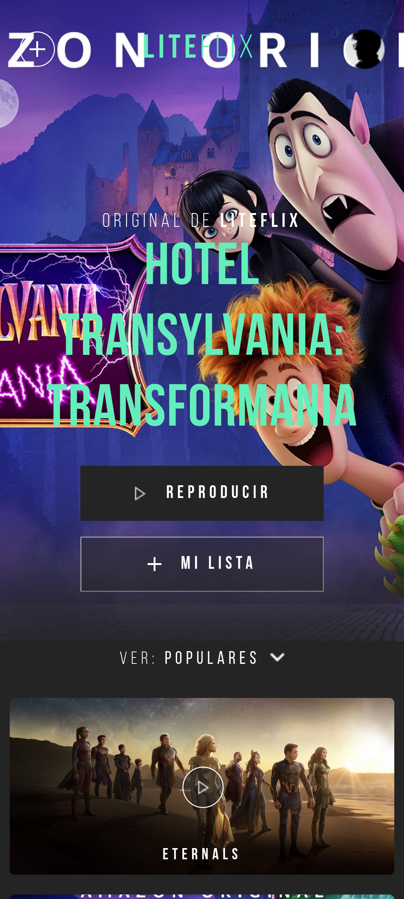

<p align='left'>
    
</p>

# Liteflix Challenge



## Descripción

Challenge desarrollado para la empresa <a href="https://litebox.ai/">Litebox</a>. Consiste en un catalogo de películas dinámico. Se pueden agregar nuevas películas y visualizar en la barra lateral, seleccionando <strong>Mis películas</strong> en el dropdown.

## Dependencias

- React: ^17.0.1
- Express: ^4.17.1
- Npm: 8.1.2
- Node: v16.13.1

Pueden consultar los package.json de la ruta <a href="./api/package.json">/api</a> y <a href="./client/package.json">/client</a>.

## Instrucciones para utilizar el proyecto

- Clonar o forkear el repositorio

### Configurando la DB

Crear un archivo <strong>.env</strong> en la carpeta <strong>/api</strong> con los sigs parámetros:

```bash
DB_NAME = "nombre base de datos"
DB_USER = "usuario de postgres"
DB_PASSWORD = "contraseña de postgres"
DB_HOST = "localhost"
API_KEY= "api key themoviedb.org"
```

Una vez creado y configurado el <strong>.env</strong>, hacer npm install parado en el directorio <strong>/api</strong>.

Para ejecutar el servidor, utilizar <strong>npm start</strong> (solo node), o <strong>npm run start:dev</strong> (con nodemon).

### Configurando el front

Para el front no se requiere de configuraciones adicionales. Parado en la carpeta <strong>/client</strong>, realizar <strong>npm install</strong>.

Para poner en linea el servidor del front, utilizar <strong>npm start</strong> (la primera vez puede tardar un rato).

## Presentación y funcionalidades

### Home


Pantalla inicial de la aplicación. En el top se encuentra la NavBar, donde se puede acceder al modal para agregar películas. En el fondo, se ve la película destacada del momento, junto a una barra lateral, donde se destacan las primeras 4 películas populares, y con un menu desplegable, donde ver las películas agregadas a la db. El resto de botones no tienen funcionalidad.

### Add movie



Modal en cual se puede agregar una película a la base de datos. Cuenta con un input, donde puede seleccionar o arrastrar el archivo de imagen que quiere utilizar. Tiene una barra de progreso de upload, mensaje de error, y mensaje exitoso cuando la pelicula fue correctamente subida.

### Responsive



La aplicación fue desarrollada para tener un diseño responsive, adaptado a la mayoría de pantallas.
